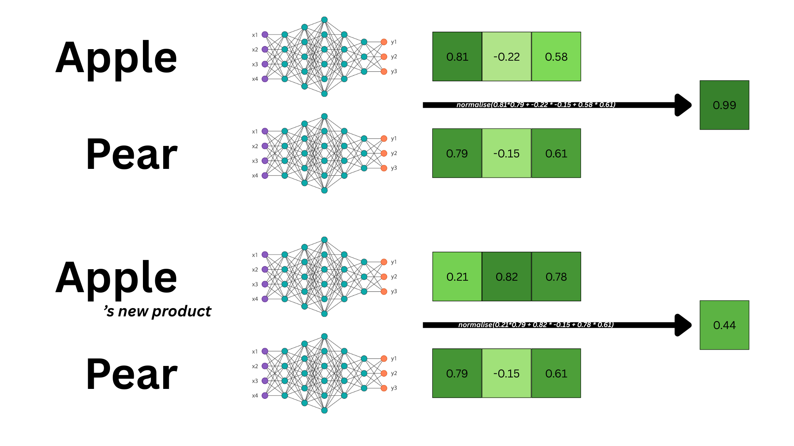
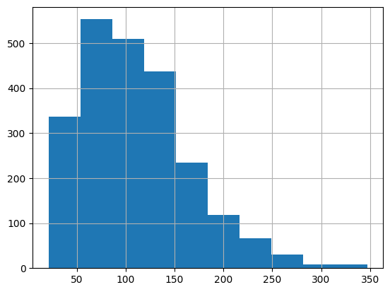
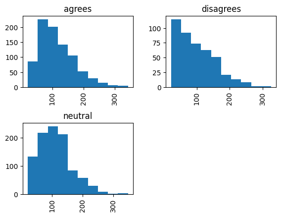
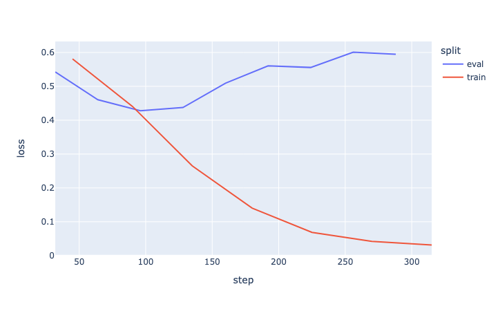
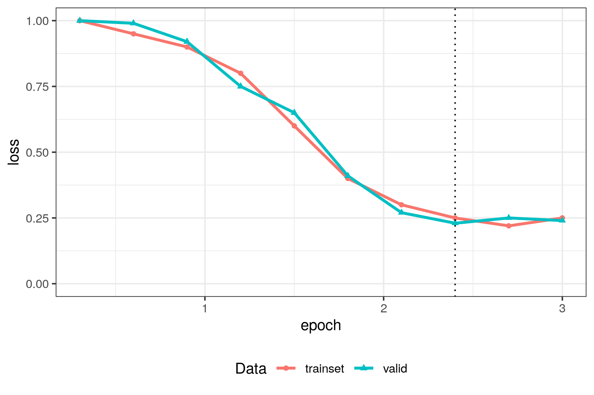
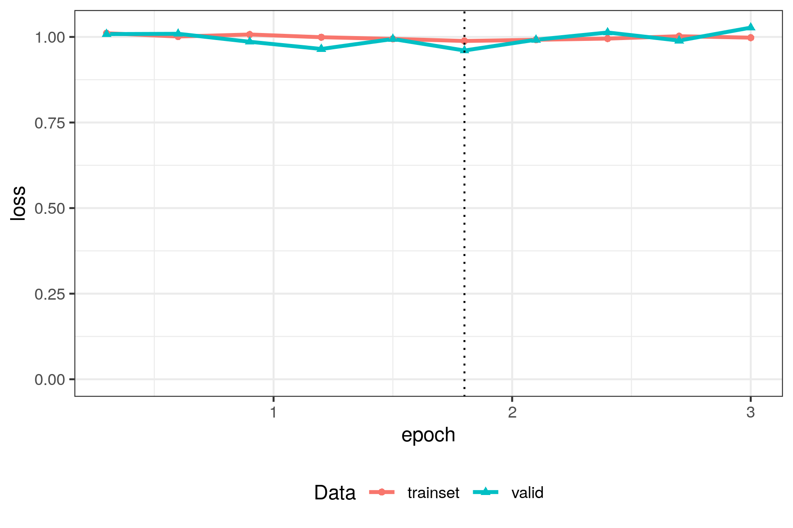
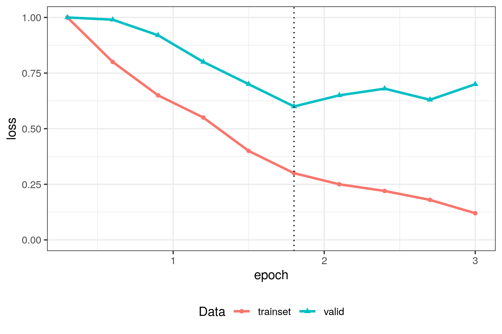

<!-- JB: Not sure we need to use the term Augmentation here, we're getting a bit more frileux on this :) -->

# Introduction

<!-- JB: Start by explaining what text annotation is --> 

<!-- ES:  Je commencerai le tutoriel de manière un peu plus douce sur les principales notions, là ça rentre vraiment dans le dur rapidement. Plus, il y a trois stratégies : encoder non finetuné, encoder finetuné et décodeur en inférence non ? On ne parle pas de plongement seuls + ML. Donc peut être un peu mieux situer l'approche, de manière un peu plus intuitive. Et peut être aussi introduire ici le fait qu'un humain est capable d'annoter et qu'on veut étendre cette équation humaine.  -->

Social scientists dealing with large corpora of documents (tweets, abstracts, newspaper articles, videos, ...) often need to annotate each item with one or more labels. To complete this cumbersome task, social scientists have adopted many strategies such as hiring interns, externalise the task to a company such as MTurk, or use computers to do the job (SOURCE of fun fact ?). Since the development of LLMs, it has now become a common practice to use them as annotators in social science contexts (Gilardi et al., 2023; Bonikowski et al, 2022; Do et al., 2022). For instance Claesson (2026) annotated 4.5 million tweets addressed to French members of the parliament. Each tweet could be assigned the labels "attack", "critique" or "support". With these annotations, she was able to describe the conditions of hate speech towards French parliamentarians on twitter. <!-- TODO reformulate --> In the Machine Learning jargon, the annotation task is referred to as a "classification task".

_AM: i want to say "its not magic, don't use an LLM for fun and pretend it's science". Dont know if we must, dont know how to phrase it_<br/>
These practices are at the intersection of quantitative social sciences and computer science called _the Computational Social Sciences_. This field of studies builds upon social science theories and leverages computer science methods to scale projects or offer new analyses. In the case of corpus annotation, scientists must define the labels and codebook based on social science theories. To assist social scientists in this task, our team developped [ActiveTigger](css.cnrs.fr/active-tigger), an open-source software, designed by and for social scientists, to support collaborative text annotation and code-free model fine-tuning.


In this series of tutorials we dive into the technicalities of the classification pipeline using LLMs as annotators. In a previous [tutoriel](https://www.css.cnrs.fr/classification-with-generative-llms-and-api-calls/), we demonstrated how to use generative AI (genAI) for this task; the pipeline consisted of creating an appropriate prompt and retrieving the label in the genAI response. In this tutorial however we demonstrate how to use an encoder model (an LLM that does not generate texts) (AM: JB is it the right term or should we call it an embedding model?) to perform this task. We are going to use smaller[^smaller-info] open weights models[^open-weights] and "teach" it how to annotate texts the way an expert would using the supervised learning framework[^supervised-learning-disclaimer]. Researchers can maintain more control on the model and its performance, however, implementing such techniques requires more NLP knowledge and coding skills. Therefore this tutorial is longer and introduces many concepts that could be overlooked when using black box models.

[^smaller-info]: Smallest generative models weigh 16GB ([Llama-3-8B](https://huggingface.co/meta-llama/Meta-Llama-3-8B-Instruct/tree/main)) and larger models can easily reach  850GB ([Deepseek-V4-pro](https://huggingface.co/deepseek-ai/DeepSeek-V4-Pro/tree/main)). On the other hand, the models we'll use weigh from 500MB ([google-bert/bert-base-uncased](https://huggingface.co/google-bert/bert-base-uncased)) to 2.3BG ([FacebookAI/xlm-roberta-large](https://huggingface.co/FacebookAI/xlm-roberta-large/tree/main)).

[^open-weights]: Meaning you can download models on your machine, which is not the case for most proprietary models.

[^supervised-learning-disclaimer]: If you are unfamiliar with the term "supervised learning", it is defined in @sec-classification-task.


The main objective of this tutorial is to **fine-tune** an **encoder model** and introduce the key concepts so you can adapt the code to your specific task. 

After presenting the objectives, materials and setup steps, we introduce the key NLP and Machine Learning concepts, we will break down the pipeline starting with loading the dataset and format it, then load the model and set the hyperparameters, finally launch the fine-tuning process. Once the process finishes, we will assess the performance and discuss how we can tweak the hyperparameters to reach satisfying performance. We conclude this tutorial with advices on how to correctly incorporate the results in a social science project. Throughout the tutoriel we provide practical insights on how to best use your hardware.

<!-- TODO: write a pros and cons of the two methods -->

## Objectives and materials

In this tutorial we will :

- Identify the main NLP and Machine Learning concepts.
- Understand the general pipeline for text classification with encoder models.
- Develop some familiarity with preprocessing and training techniques.
- Introduce the key metrics to evaluate models' performance.
- Discuss how to properly incorporate this step in your research using state-of-the-art practices.

In this tutorial, we will NOT cover : 

- The Python syntax, we expect readers to already have some knowledge of the coding language. See [Lino's course](https://pythonds.linogaliana.fr/) for an introduction 
- The fundamentals of NLP and the intersection of linguistics and computer science, we will only introduce concepts necessary to understanding this tutorial. See [Jurafsky](https://web.stanford.edu/~jurafsky/slp3/) 
- The conceptualisation of your research question to fall into the automatic annotation framework, we expect readers to be able to design their protocol and motivate it using appropriate social sciences or any domain speficic concepts.

We provide a notebook with all cells pre-run [here](https://github.com/AXLMRIN/encoder-classifier-tuto/blob/main/tuto.ipynb)

## Install environment: 

For this tutorial we use Python version 3.12 and setup the environment with the following command:

```bash
pip install -qU pandas "transformers==4.52.4" datasets ipykernel matplotlib torch "accelerate>=0.26.0" scikit-learn plotly "nbformat>=4.2.0"
```
<!-- TODO Update -->

We use SOTA Python librairies such as [PyTorch](https://pytorch.org/) and [Transformers](https://huggingface.co/docs/transformers/index). These librairies are well documented and large online communities of users have posted much valuable content to assist you during your journey. More specifically, it is likely that you will face implementation issues related to the versions of the libraries; many forums will guide you into choosing the adequate librairies versions to install depending on your task and model of choice. For this reason, we recommend using a virtual environments manager such as conda[^4] or uv[^5] and keep track of your versions to save painful debugging time in the long run.

[^4]: [Set up your cuda environment](https://www.youtube.com/watch?v=sDCtY9Z1bqE)

[^5]: [More on UV](XXX), XXXX

# Key concepts and valuable resources to start your NLP journey{#sec-key-concepts}

In this tutorial we will **fine-tune** a **pretrained language model** of type **encoder** to perform a **classification** task. The description itself needs clarification, we will endeavor to shed light on all of these keywords while remaining on the surface level to keep this tutorial legible. At each step, we provide valuable resources to further understand the concepts as well as the links to the litterature.


::: {.callout-warning}
Question : est-ce qu'on parle d'autres encodeurs que des BERT dans ce tytorial, si non : pourquoi ne pas se concentrer sur les BERT ?

AM: Non, c'est vrai mais si on se concentre sur des BERTs des non-initiés risqueraient de ne pas faire le lien entre BERT et encodeurs. Je me dis si on définit largement les encodeurs c'est plus facile de dire : "nous on se concentre sur les BERTs qui est un type d'encodeur". Opinion?
:::

## The classification task{#sec-classification-task}

The classification task is a concept from Machine Learning, it refers to an algorithm that will use input data (= predictors) to assign a class / label to each input. [Scikit-Learn](scikit-learn.org/stable)[^scikit-learn] puts it this way: _Identifying which category an object belongs to._ In the context of annotation, the connection is fairly direct, each text input needs to be assigned a label, therefore it is a classification task. 

[^scikit-learn]: Most famous Python library for Machine Learning. This library has had a major impact in the coding community, notably it imposed the `.fit` `.transform` syntax.

Classification is part of the **supervised learning** family in machine learning: this means that to be able to assign labels, the algorithm will first need to be **fitted** onto some **training data**, _in our case handmade annotations_. The fitting/training process consists of providing inputs and labels, so the algorithm can adapt to the task and _"learn"_. This means that social scientists will first need to annotate a small set of texts in order to train the classifier. 

Classifiers often have structuring parameters called **hyperparameters** that alter the algorithm and are not changed during training. These parameters must be set with great care in order to reach satisfying performance.

::::{.columns}

:::{.column width=70%}
To evaluate classifiers we use [normalised metrics](https://scikit-learn.org/stable/modules/model_evaluation.html#which-scoring-function-should-i-use) such as [Precision](https://en.wikipedia.org/wiki/Precision_and_recall), [Recall](https://en.wikipedia.org/wiki/Precision_and_recall), [Accuracy](https://en.wikipedia.org/wiki/Accuracy_and_precision#In_binary_classification) and [F1 score](https://en.wikipedia.org/wiki/F-score#Definition). Depending on your research you may want to optimise one metric or another. 

- Precision: _"out of all the elements predicted as class A, how many were indeed from class A?"_, this metric is rather conservative, optimising this score will limit the number of false positives.
- Recall: _"out of all the elements that should have been classified as A, how many were indeed classified as A?"_, this metric is XXX, optimising this score will limit the number of false negatives.
- Accuracy: _"across all classes, how many elements were classified correctly?"_, XXX critique of this metric JB?
- F1 score: this score is an harmonic mean of recall an precision.

:::

:::{.column width=30%}
{#fig-precision-recall width=100%}
:::

::::

To correctly assess a model evaluation and prevent cherry-picking, we proceed to separate evaluations on distinct subsets of texts and annotations:

- The training set: these items will be shown to the algorithm to _learn_. Metrics on the train set will be boosted.
- The dev set: these items will be used to assess the performance of the algorithm on new data. This set is used to choose the hyperparameters. Metrics on the dev set are likely to be boosted due to the fact that the hyperparameters are chosen to optimise this score.
- The test set: these items will be used to assess the performance of the algorithm with the chosen hyperparameters on new data. Metrics on the test set are meant to be representative of algorithm's performance on new data. Scientists are encouraged to communicate on metrics computed on the test set to prevent from cherry picking the performance metrics. 

## Models

The models used in this tutorial are neural networks. Their behaviour is entirely determined by a large set of adjustable quantities called **parameters** — also referred to as **weights** and **biases** — and **training** a model means adjusting these quantities until it produces the output you expect. For the purposes of this tutorial, this is all you need to know about their internals.

:::{.callout-note collapse="true" title="Learn more about neural networks"}

- [3Blue1Brown, *Neural networks*](https://www.youtube.com/playlist?list=PLZHQObOWTQDNU6R1_67000Dx_ZCJB-3pi): a visual, intuition-first video series. A good entry point if you have no prior exposure to the topic.
- [Michael Nielsen, *Neural Networks and Deep Learning*](http://neuralnetworksanddeeplearning.com/): a free online book, self-contained and readable without an advanced mathematical background.
- [Jurafsky & Martin, chapter 7: *Neural Networks*](https://web.stanford.edu/~jurafsky/slp3/7.pdf): the reference NLP textbook we cite throughout this tutorial, for readers who want the formal treatment.

:::

## Encoders vs. decoders — why not just use ChatGPT?{#sec-encoders}

Modern language models[^transformer] come in two families, and they differ in what they produce and in how they learn your annotation categories:

- **Decoder models** (GPT, Llama, Claude, the models behind ChatGPT and similar tools) produce text, so they are well suited to open-ended tasks such as conversation, drafting, summarising or translation. To annotate a corpus with a decoder, you have to instruct it every time through a prompt, and hope it interprets your instructions correctly. These models are very large, rarely runnable on a personal computer, and typically used through an API, as we did in the [previous tutorial](https://www.css.cnrs.fr/classification-with-generative-llms-and-api-calls/).
- **Encoder models** (BERT and its relatives) produce no text at all, but an **embedding**: a numerical representation of a text's meaning. This makes them well suited to tasks with a closed, well-defined output, such as classification, similarity ranking or clustering. Rather than being prompted, an encoder is **fine-tuned** on a few hundred texts you label yourself: it learns from your judgment calls, not from a description of them. Encoders are much smaller than decoders, and will most likely run on your own machine[^7].

That upfront annotation effort, and a model that only ever performs this one task, is the price you pay for an encoder — but in exchange, you keep full control over it. This has concrete consequences for cost, confidentiality and reproducibility, which we discuss next.

[^transformer]: Most are built on the **Transformer** architecture, introduced by Google in 2017 — the same word behind the `transformers` Python library you'll use throughout this tutorial.

[^7]: It tends to be less likely as newer models tend to be larger. Read more in the [Choose and load a model](#choose-and-load-a-model) section.

### Pros and cons for social science research{#sec-pros-cons}

- **Coding skills**: fine-tuning requires more code than an API call, which is both an opportunity to build skills and a cost in time. [ActiveTigger](css.cnrs.fr/active-tigger) offers a code-free alternative for collaborative annotation and fine-tuning.

<!--TODO add logo-->

- **Hardware and cost**: fine-tuning needs a machine to run on, while API calls need a paid key; neither is equally accessible to everyone.
- **Confidentiality**: sensitive corpora cannot be sent through an external API, so any model, generative or encoder, has to run on a trusted server instead. Encoders, being lighter on hardware, make that bar easier to clear.
- **Open weights, control and reproducibility**: most generative models are "closed weights", usable only through an API, while HuggingFace models, encoder or generative, are "open weights" and can be downloaded. Providers rarely disclose the data behind a closed model or its future changes, which limits interpretability and means performance can shift after an update (source). Since you own the encoder and its fine-tuning data, your results stay reproducible and easier to interpret (XXX additional techniques to probe the model???).

### How encoders represent text

The rest of this tutorial deals with encoder models only (AM: or maybe embedding models ? JB what's the difference?): texts close in meaning are given close embeddings, a proximity measured by the "similarity score" (usually the cosine distance).

{#fig-similarity width=100%}

In @fig-similarity, "apple" and "pear" score high in similarity — but in the context of Apple's new product, "apple"'s embedding shifts and the score drops. Classification works the same way: for a "left/right" label, the embeddings should capture what sets left-wing texts apart from right-wing ones.

Every encoder also has a **maximum context window**: the maximum[^max-window-size-actually] number of tokens[^tokens-def] it can process at once — anything beyond is simply ignored. Older models had short windows (128 to 512 tokens), so long texts had to be split into sentences or paragraphs.

[^max-window-size-actually]: Some techniques allow users to exceed the maximum context window, please refer to XXX @ Léo @ Alexandre

[^tokens-def]: Texts cannot be used directly and must undergo a tokenization process. Models come with a vocabulary of tokens, each text is therefore a combination of "tokens" from the vocabulary. [Read more](https://web.stanford.edu/~jurafsky/slp3/2.pdf)

BERT was released by Google in 2019; CamemBERT (French), RoBERTa and ModernBERT are later variants built on it. In this tutorial we'll use `bert-base-uncased`.

## Pretrained Models and Fine-tuning

**Pretrained** means the heavy work has already been done for you: specialised organisations with the required hardware and data have already trained these models to recognise language patterns, a process that can take from days to months (XXX source), and published the resulting weights on HuggingFace for you to download.

Fine-tuning, by contrast, is quick: a few minutes, at most a few dozen on more limited hardware. It only nudges the weights and biases, by a much smaller amount than pretraining, turning the general-purpose model into a classifier for your own labels — one assessed with the same metrics (F1 score, ...) and the same train, dev, test framework as any other classifier.

:::{.callout-note  collapse="true" title="Learn more about the Transformer architecture, the embedding space and training encoders"}

- [The illustrated transformer](https://jalammar.github.io/illustrated-transformer/)
- [What are Transformer Neural Networks](https://www.youtube.com/watch?v=XSSTuhyAmnI)
- [Jurafsky's chapter on Transformers](https://web.stanford.edu/~jurafsky/slp3/8.pdf)
- [Code your own transformer model](https://nlp.seas.harvard.edu/annotated-transformer/)

:::

# Fine-tuning pipeline: the essential{#sec-essentials}

Let's finally dive into the implementation of fine-tuning a pretrained language model of type encoder to perform a classification task!

In this section we will see the fundamentals to fine-tuning encoders for a classification task. We will use a dataset introduced by Luo et al., (2020); they collected journal articles, from which they extracted sentences conveying an opinion regarding global warming. Finally, they annotated each opinion as "agreeing", "neutral" or "disagreeing" with regard to the following statement "Climate chage/global warming is a serious concern".

The implementation follows a standard framework including the following steps:

- Load, clean and split your data: clean your texts off of noise and unwanted information and split your dataset into three subsets as described in @sec-classification-task.
- Choose a model from HuggingFace and load it on a personal computer.
- Finetune the model using the standard implementation
- Assess the model performance and update the hyperparameters 
- Predict the labels of all items using the fine-tuned model

## Load and preprocess your data{#sec-preprocess}

Data is available on the [project's GitHub repository](https://github.com/yiweiluo/GWStance/tree/master), we can download it from there using Pandas. 

```python
import pandas as pd 

url = "https://raw.githubusercontent.com/yiweiluo/GWStance/refs/heads/master/3_stance_detection/1_MTurk/full_annotations.tsv"
df_raw = pd.read_csv(url, sep = "\t") # Careful here, this document is a tsv (separator="\t" and not a csv, separator = ",")

df_raw.head()
```

|    | MACE_pred | av_rating | sentence | worker_0 | worker_1 | sent_id | ... |
|---|---|---|---|---|---|---|---|
|  0 | disagrees   |      -1     | Global warming is a hoax.                                                                                                                            | disagrees  | disagrees  | s0        | ... |
|  1 | neutral     |       0.375 | Alarming levels of sea level rise are predicted to threaten Florida over the next decades.                                                           | neutral    | neutral    | s1        | ... |
|  2 | neutral     |       0     | Over the past several years, the United States has seen an increase in business growth that has counteracted the lingering effects of the recession. | ... |neutral    | neutral    | s2        |
|  3 | agrees      |       1     | Global warming is happening and it will be dangerous to human health and welfare.                                                                    | agrees     | agrees     | s3        | ... |
|  4 | neutral     |       0     | Some icebergs are cute.                                                                                                                              | neutral    | neutral    | s4        | ... |


We will first need to explore the dataset and get a graps of its content as well as possible biases. 

As a first step, let's make a list of all the columns: 

- `sent_id`: the sentence id. It is not unique and represents something else, we will need to create a different ID.
- `sentence`: the sentence to annotate.
- `worker_#N` $N\in [1,7]$: The team tasked MTurk workers to label the data for them. Each column concatenates the labels for a given worker.
- `MACE_pred`: this is the final prediction. The team used the MACE framework to create a debiased label from the workers' labels.
- `av_rating`: The mean of all workers' annotations for a given sentence (with disagree = 1, neutral = 0, agree = 1).

Other columns include `disagree`, `agree` and `neutral` but they are empty. The `round` and `batch` columns are irrelevant for our experiment.

```python 
df = df_raw.loc[:,["sent_id", "sentence", "MACE_pred", "av_rating"]]
df = df.rename(columns={"MACE_pred" : "label_text"}) # Rename MACE_pred for conveniency
df
```

Let's have a look at the number of elements per class:

```python
df.groupby(["label_text"]).size()
```

```txt
MACE_pred
agrees       871
disagrees    441
neutral      988
dtype: int64
```

We can see that there tends to be more "neutral" or "agrees" sentences. This means that "disagrees" sentences might be trickier to spot because there will be less elements to train on.
<!-- TODO balance dataset -->

The preprocessing step is one of the most important step in the NLP pipeline, one needs to know what the corpus contains. We list a number of aspects you want to keep in mind when pre-processing your data:

**Create a unique ID for each text**

Creating an index for each text ensures that you will be able to aggregate the results. If your dataset does not contain an existing ID column, you can create one using the syntax of your choice. In our case, we will create an index that will look like this: `ID-0001`.

```python 
df["ID"] = [f'ID-{i:04}' for i in range(len(df))]
```

**The length of your documents**

Assessing the length of your documents is crucial for two reasons: 

- Firstly, as mentionned in @sec-encoders, we must check that the length of the documents are compatible with the chosen model's context window size [^preprocess-choose-model]. Also you will need to answer this question: "Where is the information that you're looking for?". For some tasks, you might want to work at the sentence level because you want to find specific elements of your corpus. For other tasks, working at the document or paragraph level is acceptable because you want to assess a global quantity
- Secondly, we need to make sure that models have roughly the same size to spot obvious issues (empty texts for instance) and ensure that we are not comparing documents of 5 words with 2 pages long documents.

[^preprocess-choose-model]: Here we mention how the chose model impacts the preprocessing of the texts whereas we have not chosen a model yet. This is a good example of how non-linear pipelines are, there are many back and forths stressing the need for a well documented pipeline.

Let's analyse the len of sentences :

```python
df["sentence-len"] = df["sentence"].apply(len)
df["sentence-len"].hist()
df["sentence-len"].describe()
```

```txt 
count    2300.000000
mean      109.890435
std        56.251317
min        21.000000
25%        70.000000
50%       100.000000
75%       145.000000
max       347.000000
Name: sentence-len, dtype: float64
```

{#fig-sentence-length-hist width=50%}


In the context of our experiment, the sentences are quite short and their size is roughly standard. We will not exclude text inputs based on their length. Keep in mind that this model will be trained on a specific task and specific material. Performances are not guaranteed for texts too different in tone, source, date, or length from the training data.

**Are there any unwanted characters**

If you are used to [TF-IDF techniques](XXX), you might be accoustumed to filtering punctuations and stop words. This is not something that we want to do when using transformers models. Indeed these models are trained with these characters and they convey meaningful context to the model. However, you might want to filter out elements that, for your study, do not carry semantic value. For instance, when working on social media content, depending on your analysis, you will want to either keep or remove emojis for instance[^recognise-emojis]. At the end of the day, you want to make sure that the elements you keep in your text carry semantic information useful for annotating.

[^recognise-emojis]: You need to ensure that the model you are using recognises emojis.

Our corpus is relatively clean given that the preprocessing stage happened at an earlier stage of the study. Skimming through the text entries, we can still find some irregularities regarding the punctuation. Let's fix these: 

```python 
def preprocess_text(text: str):
    if not(isinstance(text, str)):
        return pd.NA
    return (
        text
        .replace("``", '"')
        .replace("''", '"')
        .replace(" ,", ",")
        .replace(" .", ".")
        .replace(" !", "!")
        .replace(" ?", "?")
        .replace(" :", ":")
        .replace(" 's", "'s")
    )

df["sentence-preprocessed"] = df["sentence"].apply(preprocess_text)
```

**Are there any duplicates?** 

This can be a fatal flaw as training a model with repeated elements can outweight other annotation or completely confuse it. Let's see if we have duplicates: 

```python 
df.groupby("sentence").size().value_counts()
```

```txt 
1     2034
2        8
50       5
Name: count, dtype: int64
```

We can see that 5 elements are duplicated 50 times. Further investigations let us identify that sentences with indices starting with an "s" (`['s0', 's1', 's2', 's3', 's4']`) are duplicated 50 times. Let's remove these rows.

```python 
df_no_duplicates = df.loc[~df["sent_id"].str.startswith("s"), :] 
```

We still need to deal with the 8 elements that have a duplicate. For conciseness' sake we document this step in the [appendices of this tutorial](./appendices.qmd#sec-duplicates). You can run the lines yourself of load the checkpoint:

```python 
df_clean = pd.read_csv("./data/dataset-no-duplicates.csv")
df_clean
```

|    | sent_id   | sentence                | label_text   |   av_rating | ID      |   sentence-len | sentence-preprocessed   |
|---|---|---|---|---|---|---|---|
|  0 | t0        | Warmer-than-normal s... | agrees       |       0.625 | ID-0005 |            170 | Warmer-than-normal s... |
|  1 | t1        | We will continue to ... | neutral      |       0     | ID-0006 |             94 | We will continue to ... |
|  2 | t10       | The actual rise in s... | neutral      |       0     | ID-0007 |            118 | The actual rise in s... |
|  3 | t11       | Claims of global war... | disagrees    |      -1     | ID-0008 |             55 | Claims of global war... |
|  4 | t12       | The Intergovernmenta... | neutral      |      -0.125 | ID-0009 |            173 | The Intergovernmenta... |


:::{.callout-warning}
[ES: C'est vraiment la règle à suivre ? On garde des éléments identiques avec des annotations discordantes ? Question de curiosité; AM: Il vaut mieux éviter les doublons oui, sinon tu créé du bruit ou tu suraligne avec une phrase. Je pense que c'est pas critique mais je trouvais ça important de s'y arrêter. Opinions?]
:::

**Summary and the key ideas behind these preprocessing steps**

We have listed a limited number of preprocessings that you can perform. The first key idea behind these is to ensure that your documents will be read by the model and that the information will not be diluted in noise. To further ensure this, please refer to the model's documentation. 

:::{.callout-warning}
AM: I want to introduce the idea of bias, but i'm not sure it's the right time / right way. Opinions ?

```python 
df["sentence-len"] = df["sentence"].apply(len)
df.hist(column = "sentence-len", by="label_text")
df.groupby("label_text")["sentence-len"].describe()
```

| label_text   |   count |     mean |     std |   min |   25% |   50% |   75% |   max |
|:-------------|--------:|---------:|--------:|------:|------:|------:|------:|------:|
| agrees       |     871 | 114.91   | 56.0082 |    22 |    77 |   100 |   148 |   342 |
| disagrees    |     441 |  98.0907 | 59.0937 |    22 |    51 |    86 |   134 |   325 |
| neutral      |     988 | 110.732  | 54.4368 |    21 |    72 |   104 |   148 |   347 |



We can see that sentences are short, with similar length distributions across the "agrees" annotated items and "neutral" annotated items. On the other hand, "disagrees" annotated items seem to be shorter on average. This can be problematic if the gap is too large because you want to preserve some coherence between the texts. Also, automatic annotation algorithms exploit significant differences between items; at this point we do not know if the length if the texts is a difference to exploit or normalise.

:::

Another key idea is to ensure sufficient homogeneity. Indeed, to perform the classification, an algorithm will exploit the differences between the texts with different labels. If texts of a certain class are longer than others, the algorithm might use this information to tell the difference. Depending on your research question, this might be a good thing or not. 

**Final step: Create splits**

As described in @sec-classification-task, we need to split the availables annotations into three sets: train, dev and test. In general, we allocate 70% of the data to the train set, then 15% to dev set and test eval set. Depending on the size of your dataset, you might want to tweak this distribution. Ultimately, you want enough data for training and evaluation for scores to be significative.

```python 
from datasets import Dataset, DatasetDict
ds = Dataset.from_pandas(df_no_duplicates)

temp = ds.train_test_split(test_size = 0.3, shuffle=True)
ds_train = temp["train"]
temp = temp["test"].train_test_split(test_size = 0.5, shuffle = True)
ds_dev = temp["train"]
ds_test = temp["test"]

dsd = DatasetDict({
  "train": ds_train,
  "dev": ds_dev,
  "test": ds_test
})
```

```
DatasetDict({
    train: Dataset({
        features: ['sent_id', 'sentence', 'label_text', 'av_rating', 'ID', 'sentence-len', 
        'sentence-preprocessed', '__index_level_0__'],
        num_rows: 1428
    })
    dev: Dataset({
        features: ['sent_id', 'sentence', 'label_text', 'av_rating', 'ID', 'sentence-len', 
        'sentence-preprocessed', '__index_level_0__'],
        num_rows: 306
    })
    test: Dataset({
        features: ['sent_id', 'sentence', 'label_text', 'av_rating', 'ID', 'sentence-len', 
        'sentence-preprocessed', '__index_level_0__'],
        num_rows: 307
    })
})
```

:::{.callout-warning}
[ES: la terminologie est différente de ActiveTigger, sur quoi on se base pour ne pas avoir eval / test ? JE pense que ça doit être cohérent entre nos outils et nos leçons non ? AM: Je suis d'accord. Cependant la terminologie a souvent été confuse pour certaines personnes. Est ce que ça vaudrait pas le coup de réfléchir à une terminologie claire et mettre à jour ce tuto ET AT?]
:::

## Choose and load a model

In this tutorial we use the Transformers package, maintained by [HuggingFace](https://huggingface.co/)[^huggingface]. They propose a range of open source models and datasets downlable through their API. In the context of this tutorial, we will start working with the famous BERT model named: [google-bert/bert-base-uncased](https://huggingface.co/google-bert/bert-base-uncased)

[^huggingface]: HuggingFace is a company for profit specialised in NLP and machine learning. They maintain many SOTA libraries such as [Transformers](https://huggingface.co/docs/transformers/index), [Datasets](https://huggingface.co/docs/datasets/index) or [Sentence Transormers](https://sbert.net/). On top of maintaining the libraries, they publish posts about the latest tech, tutorials on their libraries, host a forum for debugging but also propose inference and training solutions if you don't have access the required hardware.

:::{.callout-note title="How to choose a model"}
Models and their performance are highly sensitive to the task and context of use. When implementing an NLP task you might want to try several models to compare their performance. When choosing a model you want to take into account the following parameters: 

- What task was the model trained for? You can see the list of tasks when [browsing HuggingFace's models](https://huggingface.co/models). In the context of this tutorial, we want to perform a **Text Classification** task. 
- What language was the model trained on? This one is trivial. However, depending on your corpus, you might want to find models that are multilingual. Performance of multilingual models can be below monolingual models; consider trying different models (is it still true ?? @ Léo). You can also try and translate your corpus into one language and use a monolingual model. 
- What documents was the model trained on? Evaluated on? Models performance can vary a lot when used on a certain domain or another. Make sure to use models that have been XXX BENCSSMARK @ Etienne @ Paul 
- Is the model still relevant? Look at the number of downloads on the model's page; this can give you a sense of the model's popularity and (to some extent) performance. If downloads have dropped, this can be a sign that a newer version was published or that another model has become the new standard.
- Last but not least: How big is the model? You won't get away with it, your laptop has limited computation capabilities, large models need appropriate hardware. Know your hardware and check what model you can run [using this method](XXX). <!-- TODO find a method lols -->
:::

To load the model we just need to use one of the AutoModel instance[^auto-models]. In our case we are going to use the [`AutoModelForSequenceClassification`](https://huggingface.co/docs/transformers/en/model_doc/auto#transformers.AutoModelForSequenceClassification). To load the model we use the following command: 

[^auto-models]: Auto Classes are ready-to-use classes that will set up the right architecture depending on your task. 

```python 
from transformers import AutoModelForSequenceClassification

labels = list(df["label_text"].unique())
num_labels = len(labels)
id2label = {id:label for id, label in enumerate(labels)}
label2id = {label:id  for id, label in enumerate(labels)}

MODEL_NAME = "google-bert/bert-base-uncased"
model = AutoModelForSequenceClassification.from_pretrained(
    MODEL_NAME, 
    num_labels=num_labels,
    id2label=id2label,
    label2id=label2id,                                     
)
```
:::{.callout-warning}
Nota: for some models you might need to set `trust_remote_code` to `True`. _Make sure you actually trust the model you are downloading._
::: 

:::{.callout-note title="Model description" collapse="true" #nte-model-description}
We can easily observe the general architecture of the model by typing: 

```python
print(model)
```

```txt 
BertForSequenceClassification(
  (bert): BertModel(
    
    >>> This is the first step of the encoding process, use ready made embeddings 
    that will be modified with attention. We can find useful information: 
    - 30522 is the vocab size, there are 30522 entities for which there is a ready 
    made embedding.
    - 768 is the dimension of the output embeddings

    (embeddings): BertEmbeddings(
      (word_embeddings): Embedding(30522, 768, padding_idx=0)
      (position_embeddings): Embedding(512, 768)
      (token_type_embeddings): Embedding(2, 768)
      (LayerNorm): LayerNorm((768,), eps=1e-12, elementwise_affine=True)
      (dropout): Dropout(p=0.1, inplace=False)
    )

    >>> This is where the attention takes place. You can see that the encoder is a
    stack of 12 BERTlayers, themselves containing a self attention module. We find 
    again the dimension of the output embeddings: 768

    (encoder): BertEncoder(
      (layer): ModuleList(
        (0-11): 12 x BertLayer(
          (attention): BertAttention(
            (self): BertSdpaSelfAttention(
              (query): Linear(in_features=768, out_features=768, bias=True)
              (key): Linear(in_features=768, out_features=768, bias=True)
              (value): Linear(in_features=768, out_features=768, bias=True)
              (dropout): Dropout(p=0.1, inplace=False)
            )
            (output): BertSelfOutput(
              (dense): Linear(in_features=768, out_features=768, bias=True)
              (LayerNorm): LayerNorm((768,), eps=1e-12, elementwise_affine=True)
              (dropout): Dropout(p=0.1, inplace=False)
            )
          )
          (intermediate): BertIntermediate(
            (dense): Linear(in_features=768, out_features=3072, bias=True)
            (intermediate_act_fn): GELUActivation()
          )
          (output): BertOutput(
            (dense): Linear(in_features=3072, out_features=768, bias=True)
            (LayerNorm): LayerNorm((768,), eps=1e-12, elementwise_affine=True)
            (dropout): Dropout(p=0.1, inplace=False)
          )
        )
      )
    )

    >>> This pooler is the component that will take the embedding of each token in 
    the sequence and produce a unique embedding, supposedly best representing the sequene.

    (pooler): BertPooler(
      (dense): Linear(in_features=768, out_features=768, bias=True)
      (activation): Tanh()
    )
  )
  (dropout): Dropout(p=0.1, inplace=False)

  >>> This last component is the classifier layer, a neural network composed of 768 
  + 3 nodes. The out_features=3 corresponds to the number of labels we are using for 
  annotation! 

  (classifier): Linear(in_features=768, out_features=3, bias=True)
)
```

:::

:::{.callout-note title="Tips and tricks - Read the model configuration" collapse="true"}

The `AutoConfig` class is very convenient for retrieveing information that may be difficult to obtain otherwise because models' documentation sometimes lack precision. We load it like this: 

```python 
from transformers import AutoConfig
print(AutoConfig.from_pretrained(MODEL_NAME))
```

```txt 
BertConfig {
  "architectures": [
    "BertForMaskedLM"
  ],
  "attention_probs_dropout_prob": 0.1,
  "classifier_dropout": null,
  "gradient_checkpointing": false,
  "hidden_act": "gelu",
  "hidden_dropout_prob": 0.1,
  
  >>> Embedding dimension 
  "hidden_size": 768,
  
  "initializer_range": 0.02,
  "intermediate_size": 3072,
  "layer_norm_eps": 1e-12,
  
  >>> Maximum context window
  "max_position_embeddings": 512,
  
  "model_type": "bert",
  "num_attention_heads": 12,
  "num_hidden_layers": 12,
  "pad_token_id": 0,
  "position_embedding_type": "absolute",
  "transformers_version": "4.52.4",
  "type_vocab_size": 2,
  "use_cache": true,

  >>> Vocab size identified earlier
  "vocab_size": 30522
}
```
:::

## Fine-tune the model

We are finally going to fine-tune the model on our specific data. To do so, we are going to proceed with the 3 following steps:  

- Tokenize the dataset
- Setup the training arguments
- Launch training

### Tokenize the dataset{#sec-tokenization}

Tokenizing consists of two steps, first text patterns are transformed into tokens from the model's vocabulary, then each sentence is truncated or padded so that every entry has the same length. 

:::{.callout-tip title="Example" collapse="true"}
```python 
tokenizer("Hello World! 😇")
# {'input_ids': [101, 7592, ...], 'token_type_ids': [0, 0, ...], 'attention_mask': [1, 1, ...]}
tokenizer("Hello World! 😇").input_ids
# [101, 7592, 2088, 999, 102] <- the token id
tokenizer.decode([101, 7592, 2088, 999, 100, 102])
# '[CLS] hello world! [UNK] [SEP]' 
# [CLS] is the starting token and [SEP] the terminating one.
# The smiley is marked as unknown [UNK]
tokenizer.decode([101])
# '[CLS]' <- token number 101 
tokenizer.decode([2088, 999])
# 'world!' <- tokens number 2088 and 999
tokenizer(
  [lorem.get_sentence(count=20), # Very long
   lorem.get_sentence(count=2)]  # Very short
  truncation = True, 
  padding = "max_length", 
  max_length = 50, 
  return_tensors = "np"
).input_ids.shape
# (2, 50) <- long entries are truncated and short ones are padded so that all tokenized entries are the same length
```
:::

The tokenizer[^tokens-def] needs to be loaded just as we did with the model: 

```python 
from transformers import AutoTokenizer

tokenizer = AutoTokenizer.from_pretrained(MODEL_NAME)
```

Then choosing the parameters for the tokenizer and writing a preprocessing function: 

```python 
def preprocess_dataset(row: dict):
  tokenized_entry = tokenizer(
    row["sentence-preprocessed"],
    truncation = True, 
    padding = "max_length",
    max_length = 400,
  )
  return {
      **row.copy(),
      "labels": int(label2id[row["label_text"]]),
      **tokenized_entry
  }

dsd = dsd.map(preprocess_dataset)
# Only keep columns useful for training
dsd = dsd.select_columns(['ID', 'labels', 'input_ids', 'token_type_ids', 'attention_mask'])
# Set the dataset dict format to torch
dsd = dsd.with_format("torch")
dsd
```

```
DatasetDict({
    train: Dataset({
        features: ['ID', 'labels', 'input_ids', 'token_type_ids', 'attention_mask'],
        num_rows: 1428
    })
    dev: Dataset({
        features: ['ID', 'labels', 'input_ids', 'token_type_ids', 'attention_mask'],
        num_rows: 306
    })
    test: Dataset({
        features: ['ID', 'labels', 'input_ids', 'token_type_ids', 'attention_mask'],
        num_rows: 307
    })
})
```

The data is ready to be used for Fine-Tuning! 

### Setup fine-tuning hyperparameters{#sec-training-parameters}

The fine-tuning parameters are stored in the `TrainingArguments`[^training-or-fine-tuning] object. We have selected the main parameters that you'll want to look for during training, but you can browse the [117 parameters it can take](https://huggingface.co/docs/transformers/v4.49.0/en/main_classes/trainer#transformers.TrainingArguments). You'll find more information about what hyperparameters represent and how to tune them in @sec-hyperparameters-tuning.

[^training-or-fine-tuning]: The syntax would be the same if you trained a model from scratch, therefore the pipeline uses training related names (Trainer, TrainingArguments, ...), but that does not change the fact that we are indeed *fine-tuning* a model.

```python 
from transformers import TrainingArguments, Trainer
training_arguments = TrainingArguments(
    # Hyperparameters
    num_train_epochs = 5,
    learning_rate = 5e-5,
    weight_decay  = 0.0,
    optim = "adamw_torch_fused",
    # Second order hyperparameters
    per_device_train_batch_size = 4,
    per_device_eval_batch_size = 4,
    gradient_accumulation_steps = 8,
    # Metrics
    # metric_for_best_model="f1_macro", # TODO implement F1 as metric: MOVE TO EXPERT
    # Pipe
    output_dir = "./models/training",
    eval_strategy = "steps"   , eval_steps    = 0.05,
    logging_strategy = "steps", logging_steps = 0.05,
    save_strategy = "steps"   , save_steps    = 0.05,
    load_best_model_at_end = True,
    save_total_limit = 2,

    disable_tqdm = False,
)
```

### Launch fine-tuning

Finally, we can start the process, all it takes is 2 more lines of code:

```python
trainer = Trainer(
    model = model, 
    args = training_arguments,
    train_dataset=dsd["train"],
    eval_dataset=dsd["train_eval"],
)

trainer.train()
```

|   epoch |   Step |   Training loss |   Evaluation loss |
|--------:|-------:|----------------:|------------------:|
|  0.5263 |     19 |           8.163 |            0.9146 |
|  1.053  |     38 |           6.869 |            0.8175 |
|  1.579  |     57 |           5.298 |            0.8265 |
|  2.105  |     76 |           4.4   |            0.8267 |
|  2.632  |     95 |           3.065 |            0.9924 |
|  3.158  |    114 |           2.548 |            1.032  |
|  3.684  |    133 |           1.826 |            0.9477 |
|  4.211  |    152 |           1.622 |            0.9651 |
|  4.737  |    171 |           1.05  |            1.1    |
|  5.0    |    190 |           1.09  |            1.14   | <!-- this line is made up do we want to keep it?? -->

<!-- TODO SETUP F1 macro as metric -->

<!-- TODO add training table -->

As a result you will get get a list of folders[^save-strategy], each containing the following files: 

[^save-strategy]: Depending on the `save_strategy` you set.

- `config.json`: a dictionnary with the config, similar to `AutoConfig`.
- `model.safetensors`: a file containing all the weights of the Model.
- `optimizer.pt`, `rng_state.pth` and `scheduler.pt`: a copy of the optimizer, rng_state and scheduler used during training. 
- `trainer_state.json`: a dictionnary containing all metadata up to the current checkpoint.
- `training_args.bin`: a copy of the training arguments.

The model can be loaded like before: 

```python 
reload_model = AutoModelForSequenceClassification.from_pretrained(
    "./models/training/checkpoint-76")
```

It is worth noting that the trainer output also contains the best training checkpoint `trainer.state.best_model_checkpoint`. In our case, the best checkpoint is the checkpoint number 38`'./models/training/checkpoint-76'` the evaluation loss reaches a minimum (0.81) for this checkpoint.

## Use model for inference and evaluate performance{#sec-evaluation}

To evaluate the performance, we use the dev set (see @sec-preprocess) gold standard annotations and predicted ones, then compute the metrics introduced in @sec-classification-task: Accuracy, Precision, Recall and F1-score. Therefore the first step is to predict the labels on the dev set: 

<!-- TODO s'assurer que ça ça fonctionne sur CPU -->
::::{.columns}
:::{.column-body}
```python 
IDs = []
y_gold = []
y_pred = []

# Reload the best model: 
model = AutoModelForSequenceClassification.from_pretrained(trainer.state.best_model_checkpoint)
model.eval()

for batch in tqdm(dsd["dev"].batch(8)): 
  IDs += [batch["ID"]]
  y_gold += [batch["labels"]]
  with torch.no_grad():
    logits = model(input_ids = batch["input_ids"], attention_mask = batch["attention_mask"]).logits.softmax(1).numpy()
    y_pred += [np.argmax(logits, axis=1)]
results = pd.DataFrame({
  "ID": np.concat(ID),
  "gold": np.concat(y_gold),
  "pred": np.concat(pred)
})
```
:::

:::{.callout-note}
If you want to develop your understanding of the objects we manipulate, we provide a setp by step description in the [appendices](./appendices.qmd#sec-ins-and-outs)
:::
:::{.column-margin}
Note that this code snippet will only run if the model is loaded on your CPU. See @sec-GPU for device discussions.
:::
::::

Then, once we have the predictions, we can compute the metrics. In general, we recommand using the macro[^macro-def] F1 as it is the most representative of the model performance and works well with unbalanced datasets. Either way, you can use [`scikit-learn`'s `classification_report` function](https://scikit-learn.org/stable/modules/model_evaluation.html#classification-metrics) to compute all metrics at once : 

[^macro-def]: "macro" means that the evaluation normalises for the number of labels. Example in [the appendices](./appendices.qmd#sec-macro-micro).


```python 
from sklearn.metrics import classification_report

print(classification_report(
    y_true = results["gold"].map(id2label)
    y_pred = results["pred"].map(id2label)
))
```
```txt
              precision    recall  f1-score   support

      agrees       0.74      0.61      0.67       122
   disagrees       0.59      0.38      0.46        58
     neutral       0.62      0.83      0.71       126

    accuracy                           0.66       306
   macro avg       0.65      0.61      0.62       306
weighted avg       0.67      0.66      0.65       306
```

Here we can see that the model's performance for the labels "agrees" and "neutral" is decent, but would benefit from further hyperparameter tuning. On the other hand, the model does not recognise the "disagrees" label. All in all, the current finetuning leads to mediocre results. In @sec-advanced, we will tweak the hyperparameters to reach better results. 


## Conclusion{#sec-essentials-conclusion}

In this section we have covered the basics to load the data and model, launch the fine-tuning and evaluate performances. We discussed: 

- The importance of knowing your corpus and preprocessing the texts depending on your research question.
- How to choose a model depending on the task.
- Prepare the data for fine-tuning (tokenization and formatting) and set the hyperparameters.
- Launch the fine-tuning process.
- Use the model for inference and evaluate the model using classification metrics.

You now have all the technical knowledge necessary to fine-tune most classification models using the HuggingFace `AutoModelForSequenceClassification` pipeline. However, in the @sec-evaluation, we saw that the performance were not optimal. In the following section, we will explore other model outputs to gain further insights and modify the hyperparameters to reach better performances. Also, the pipeline did not make use of more advanced hardware such as GPUs and Apple MX chips, we will discuss how to adapt the code accordingly.

# Training pipeline: advanced practices{#sec-advanced}

## Diagnose and fix training problems{#sec-hyperparameters-tuning}

In @sec-essentials we fine-tuned a BERT model and saved checkpoints containing crucial information; one of them is the learning curve. The learning curve tracks the loss function[^lossFunction] — a measure of the distance between the predicted labels and the gold standard labels — on the train set and the dev set as training progresses. We can retrieve it from the logs in `trainer_state.json` and plot it:

[^lossFunction]: The loss function is a function measuring the distance between the predicted labels and the gold standard labels.

```python
# TODO update and make it simpler
import json
import plotly.express as px

with open("./models/training/trainer_state.json", "r") as file:  # MODIFY !!!
    training_state = json.load(file)

loss = []

for log in training_state ["log_history"]:
    step = log["step"]
    if "loss" in log:
        loss += [{"step": step, "loss": log["loss"], "split": "train"}]
    elif "eval_loss" in log:
        loss += [{"step": step, "loss": log["eval_loss"], "split": "eval"}]
    else:
        # thweird
        print(log)

loss = pd.DataFrame(loss)

px.line(loss, x = "step", y = "loss", color =  "split")
```

{#fig-learning-curve width=70%}

The train loss decreases steadily towards 0, while the dev loss decreases, reaches a minimum, then rises again. That rise is expected: it simply means the model keeps memorising the train set past the point where it stopped generalising better, which is why we reload the checkpoint at the minimum (@sec-evaluation) rather than the last one. What matters is how low that minimum is, and how the two curves sit relative to each other. Here is the pattern to aim for:

::::{.columns}

:::{.column width=50%}

**The perfect case scenario**

- Both curves went down during training: the model has learned
- Both curves have the same loss values: no overfitting
- The curves are flat at the end: nothing more to be learned, apparently

Once your learning curve looks like this, you only have to look at the evaluation metrics to see if you are satisfied with the prediction quality. If it does not, one of the problems below is likely the cause — each comes with the hyperparameters that fix it.

:::

:::{.column width=50%}



:::

::::

To follow the rest of this section, one mental image is enough. Fine-tuning proceeds by small successive corrections: the model reads a **batch** of annotated texts, compares its predictions with your annotations, and adjusts its parameters slightly in the direction that reduces the gap. It then moves on to the next batch, and repeats until it has gone through the entire training set — that is one **epoch**. The hyperparameters below govern *how many* texts the model reads before each correction, *how large* each correction is, and *how many times* the model goes through your data.

**Problem 1: the model hasn't learned enough**

::::{.columns}

:::{.column width=50%}



:::

:::{.column width=50%}


:::

::::

At one extreme, both curves stay flat throughout training (left): the metrics are barely better than chance, and the losses have hardly moved — the corrections applied to the model were either too small to have any effect, or too few. At the other extreme, both curves are still going down together with no plateau in sight (right): the model is learning correctly, it simply hasn't finished.

- The **learning rate** 🟢🟢🟢 _(importance)_ sets the size of each correction. It is by far the most consequential hyperparameter: set too low, the fine-tuning leaves the model essentially unchanged. Try increasing it. Typical values: $[1e-6, 1e-4]$.
- The **number of epochs** 🟢 sets how many times the model goes through your training set. If performance was still improving when training stopped, the model simply did not get enough passes over your data. Typical values: 3-5, bearing in mind that each additional epoch costs computation time.

**Problem 2: the model has learned your training set by heart**

{width=50%}

The model performs very well on the texts it was trained on, and noticeably worse on the dev set: both curves went down, but the train curve sits much lower than the dev curve. It has memorised your training examples instead of learning the distinction you are after. This is called **overfitting**, and it is the most common failure in this kind of project, particularly when annotations are few.

- The **weight decay**[^alias-weight-decay] 🟢🟢 discourages the model from adopting extreme parameter values, which is the mechanism through which memorisation usually happens. Increasing it constrains the model and pushes it towards more general solutions; setting it too high prevents it from learning at all. Typical values: 0.01-0.1.
- Lowering the **learning rate** or the **number of epochs** works towards the same end: fewer and gentler corrections leave the model less opportunity to fit the specifics of your examples.
- The most reliable remedy, however, is not a hyperparameter: annotate more data.

**Problem 3: the fine-tuning is erratic**

{width=50%}

Performance jumps up and down from one evaluation to the next instead of improving steadily. The corrections are being computed on too little evidence at a time, so each one chases the peculiarities of a handful of texts rather than a general pattern.

- The **batch size** 🟢🟢 is the number of texts the model reads before each correction. The larger the batch, the more each correction reflects a general tendency of your corpus rather than the noise of a few individual texts. Typical values: 16-64.
- A learning rate set too high produces the same symptom for a different reason: each correction overshoots. If enlarging the batch is not enough, lower the learning rate.

**Problem 4: the fine-tuning does not fit on your machine**

This one does not show up on the learning curve: large batches are desirable, but the whole batch must be held in memory at once, and this is usually where a personal computer gives up (see @sec-GPU). The way around it is to accumulate several small batches before applying a correction, which is almost equivalent and requires far less memory:

$$\text{Batch size} = \text{Device batch size} \times \text{Gradient accumulation steps}$$

- The **device batch size** is what your hardware actually processes at once: lower it until the training fits in memory.
- The **gradient accumulation steps** compensates, so that the effective batch size stays in the range you wanted.

Disk space calls for the same kind of attention. The **eval** and **save strategies** 🔴 can be set to `"epoch"` or `"steps"`; with `"steps"`, the `eval_steps` and `save_steps` parameters control how often the model is evaluated and saved. Since each checkpoint can weigh several gigabytes, use `save_total_limit`[^note-save-total-limit] to cap the number of checkpoints kept on disk.

:::{.callout-tip title="Where to start"}
If you only change one hyperparameter, change the learning rate. A reasonable strategy is to keep everything else at the values used in @sec-training-parameters, try a few learning rates spanning the typical range (for instance 1e-5, 3e-5 and 5e-5), and compare the resulting learning curves. Only then is it worth tuning the weight decay and the batch size. Remember that these choices must be made by comparing performance on the **dev** set, never on the test set (@sec-classification-task).
:::

[^alias-weight-decay]: AKA: L2-regularization.

[^note-save-total-limit]: If you use `load_best_model_at_end=True`, make sure to have `save_total_limit` > 2, otherwise the best model will be overwritten by the last model ([documentation](https://huggingface.co/docs/transformers/main_classes/trainer#transformers.TrainingArguments.save_total_limit)).

## Use GPU for faster training{#sec-GPU}

For now we have only used the CPU to perform the training, but it is slow and alternatives exist. If you have a NVIDIA GPU[^2] and have set up your cuda[^3] environment, you may accelerate the process. Also, if you have a Mac with an MX chip, you can use mps to accelerate the training. 

[^2]: [AMD GPUs do not have access to cuda](https://www.tutorialpedia.org/blog/is-it-possible-to-run-cuda-on-amd-gpus/#2-closed-source-ecosystem) but you can work you way out with alternative solutions like [ZLuda](https://github.com/vosen/ZLUDA)

[^3]: [What is cuda in 3 mins](https://www.youtube.com/watch?v=pPStdjuYzSI); [Install cuda on your machine](https://developer.nvidia.com/cuda-downloads)

You can check if your environment is ready to use cuda and mps with the following lines: 

```python 
from torch.cuda import is_available as cuda_available
from torch.mps import is_available as mps_available

print("CUDA: ", cuda_available())
print("MPS: ", mps_available())
```

From there on, you will need to be aware of where your objects are stored. Indeed, in order to use the model on CUDA (or MPS), the input and the model need to be stored on the same hardware. The code for finetuning changes slightly: 

```python 
# Choose your device
DEVICE = "cuda" # or "mps", or "cpu"

# Preprocess, tokenize, format and split your data
ds = ...
# Move the dataset on the desired device:
ds = ds.with_format("torch", device = DEVICE)

# Load the model
model = ...
# move the model to the desired device
model = model.to(device = DEVICE)
# You can check the model device :
print(model.device)

# Load the training arguments: 
training_args = TrainingArguments(
  ...
  bf16= str(device) == "cuda", 
)

# Set up the trainer and launch the processing
```

The code for using the model for inference changes as well: 

```python
from torch import no_grad
IDs = []
y_gold = []
y_pred = []

# Reload the best model: 
model = AutoModelForSequenceClassification.from_pretrained(trainer.state.best_model_checkpoint)
model = model.to(device=DEVICE)
model.eval()
if str(DEVICE)=="cuda": model = model.bf16() # Only works on GPUs

for batch in tqdm(dsd["dev"].batch(8)): 
  IDs += [batch["ID"]]
  y_gold += [batch["labels"]]
  with torch.no_grad():
    probs = (
      model(input_ids = batch["input_ids"], attention_mask= batch["attention_mask"])
      .logits.cpu().softmax(1).float().numpy()
    )
    y_pred += [np.array([loop_config.id2label[int(y)] for y in y_pred])]

results = pd.DataFrame({
  "ID": np.concat(ID),
  "gold": np.concat(y_gold),
  "pred": np.concat(pred)
})
```


If you don't move the elements properly, you will face this error: 

```txt 
Expected all tensors to be on the same device, but found at least 
two devices, cuda:0 and cpu! (when checking argument for argument 
index in method wrapper_CUDA__index_select)
```

The final step is to clean your GPU after using it. Otherwise you risk clogging the memory and flushing it becomes a hassle. Best practices include working inside a `try/except/finally` loop to make sure the memory is clean after use. 

```python 
from gc import collect as gc_collect
from torch.cuda import empty_cache, synchronize, ipc_collect
from torch.cuda import is_available as cuda_available

tokenizer, model, dsd, trainer = (None, ) * 4 # All objects that are moved to the GPU
try: 
  tokenize = ...
  dsd = ...
  model = ...
  trainer = ...
  trainer.train()

except Exception as e:
    print("# ERROR" + "#" * 93)
    print(e)
    print"#" * 100)

finally:
    del tokenizer, model, dsd, trainer # All objects that are moved to the GPU
    empty_cache()
    if cuda_available():
        synchronize()
        ipc_collect()
    gc_collect()
```

## Read the errors

You will face many, many errors. Sometimes they are random and rerunning the script / restarting the kernel will solve the issue. Others are subtle and difficult to identify. In such case, copy paste the error in google (in our experience, genAI is less likely to provide you the right answer), you'll find forums with people who faced the same issue. As stressed in the introduction, downgrading/upgrading some libraries is likely to solve the issue.

### Dataset formatting

Many errors are raised due to the functions assuming that your columns are well named and that the data has the right format. Make sure to have the following: 

- `"text"` column with the text as string
- `"labels"` column with the labels as int; if you have multiple labels. Make sure this is a Tensor of integers
- `"input_ids"` a column with the tokens truncated and padded to the same length. Make sure this is a Tensor of integers
- `"attention_mask"` a column with the tokens truncated and padded to the same length. Make sure this is a Tensor of integers

Also, depending on the model you're using these columns can have different names. Make sure to check the huggingface documentation related to the model you are using as well as forums.

### Memory overflow

If you face this error using a GPU : 

```txt 
NVML_SUCCESS == r INTERNAL ASSERT FAILED at "/home/conda/feedstock_root/build_artifacts/libtorch_1750199048837/work/c10/cuda/CUDACachingAllocator.cpp":1016, please report a bug to PyTorch.
```

It is likely that you have reached the memory limit of your hardware. Reducing the device batch size or using a smaller model is likely to solve your issue. If you use a CPU the error becomes: `Invalid buffer size: `

### Tensor shapes

If you face the following error: 

```txt 
ValueError: too many values to unpack (expected 2)
```

The issue is likely to come from the tokenization step. If you type: `dsd["train"][0]["input_ids"].shape`, it must return `torch.Size([400])` and not `torch.Size([1, 400])`. Ensure that the tokenizer does not use `return_tensors="pt"` and that you use `dsd.with_format("torch")`.

### Missing keys when saving/reloading a checkpoint

You might face this scary issue: 

```txt 
There were missing keys in the checkpoint model loaded: ['bert.embeddings.LayerNorm.weight', ...
There were unexpected keys in the checkpoint model loaded: ['bert.embeddings.LayerNorm.beta', ...
```

This is merely a convention issue. Some models/versions use beta/gamma keywords instead of weights/biases. This is not a problem and the model solve this automatically. If the loaded model shows unexpected low performance, this might be a sign that the model did not solve this issue automatically. You might have to rename the parameters yourself using the right convention _(very unlikely)_.

# Some good practices

## Save your model and results 

??? necessary ??? -> Export to hugging face for reproducibility and open science

## On annotating your Dataset

@ Etienne

## What's a good score? 

@ Etienne @ Julien

# Conclusion

In this tutorial we covered many topics:
- In @sec-key-concepts we defined some key concepts such as the supervised learning framework, BERT models and fine-tuning. It is important to have a broad understanding of these in order to easily manipulate the objects and adapt the code.
- In @sec-essentials we laid out the usual fine-tuning pipeline including data processing and formatting, choosing the model, launching the fine-tuning and assessing the performance. @sec-essentials-conclusion summarises the main steps.
- In @sec-advanced we stopped on more complex concepts such as the reading curve and provided instructions on how to tweak the hyperparameters. This section also discusses using GPU for quicker training and provides hotfixes for common errors.

# Bibliography 
